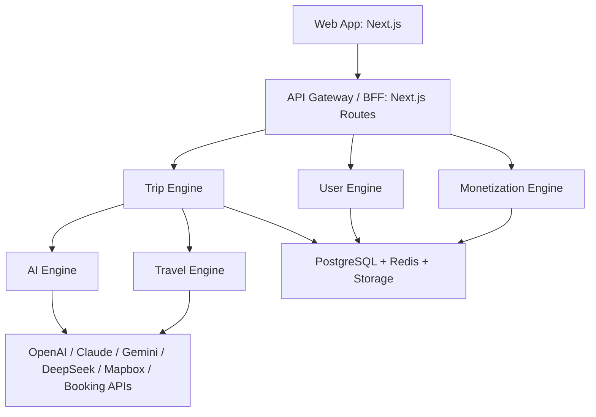

# Voyage AI Platform Architecture

Voyage AI should be treated as a platform, not a travel landing page.



## Product Areas

- AI: chat, itinerary, memory, recommendations and agent tools.
- Trips: planner, dashboard, packing, expenses, weather, maps and documents.
- Booking: hotels, flights, trains, buses, activities and insurance.
- User: profile, preferences, rewards, referrals and saved places.
- Premium: subscriptions, usage limits and paid AI features.
- Business: payments, invoices, affiliate revenue and commissions.
- Admin: analytics, users, trips, bookings, revenue, feedback, AI cost and API logs.

## Core Rule

UI components must not call provider APIs directly. They call application services. Services can call engines. Engines can call provider adapters.

```text
UI -> Trip Service -> Trip Engine -> AI Orchestrator -> Agent -> Provider Adapter
UI -> Booking Service -> Booking Provider Interface -> Booking.com / Agoda / Mock
```

This keeps the app cheap during MVP and makes provider replacement simple later.
