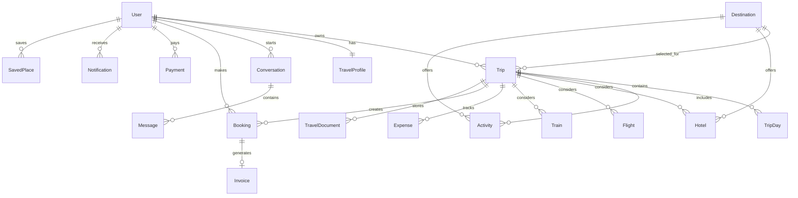

# Database ERD

```mermaid
erDiagram
  User ||--o{ Trip : owns
  User ||--|| TravelProfile : has
  User ||--o{ Conversation : starts
  User ||--o{ Booking : makes
  User ||--o{ Payment : pays
  User ||--o{ Notification : receives
  User ||--o{ SavedPlace : saves
  Trip ||--o{ TripDay : contains
  Trip ||--o{ Activity : includes
  Trip ||--o{ Hotel : considers
  Trip ||--o{ Flight : considers
  Trip ||--o{ Train : considers
  Trip ||--o{ Expense : tracks
  Trip ||--o{ Booking : creates
  Trip ||--o{ TravelDocument : stores
  Conversation ||--o{ Message : contains
  Destination ||--o{ Trip : selected_for
  Destination ||--o{ Hotel : offers
  Destination ||--o{ Activity : offers
  Booking ||--o| Invoice : generates
```
